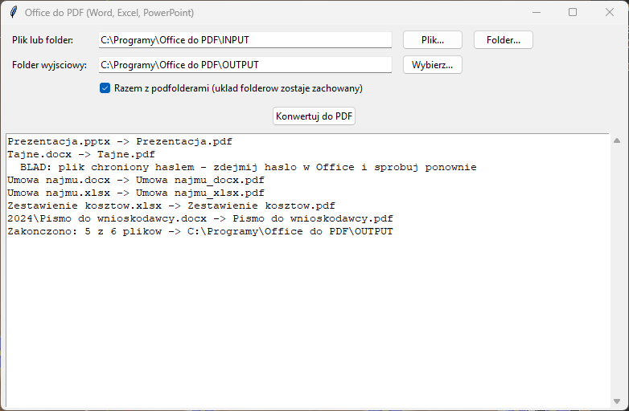

# Office do PDF (Word, Excel, PowerPoint)

Masowa konwersja dokumentów Office do PDF — cały folder jednym kliknięciem,
także z podfolderami. Program **lokalny**: konwersję robi zainstalowany na
komputerze Microsoft Office, więc PDF wygląda dokładnie tak jak wydruk
z Worda, Excela czy PowerPointa. Dokumenty nigdzie nie są wysyłane.
Z internetem program łączy się tylko po to, żeby sprawdzić
[aktualizacje](#aktualizacje).



## Co konwertuje

| Program Office | Pliki |
|----------------|-------|
| Word | `.doc`, `.docx`, `.docm`, `.rtf`, `.odt` |
| Excel | `.xls`, `.xlsx`, `.xlsm`, `.ods` — wszystkie arkusze do jednego PDF |
| PowerPoint | `.ppt`, `.pptx`, `.pptm`, `.odp` |

**Wymagany Microsoft Office** (wersja 2010 lub nowsza). Wystarczą te
programy, których pliki chcesz konwertować — bez PowerPointa reszta
działa normalnie, a przy prezentacjach pojawi się komunikat w logu.

## Co powstaje

- `umowa.docx` → `umowa.pdf` w folderze wyjściowym. Oryginały nie są zmieniane.
- Gdy w jednym folderze są pliki o tej samej nazwie, np. `umowa.docx`
  i `umowa.xlsx`, powstają `umowa_docx.pdf` i `umowa_xlsx.pdf`
  (żaden nie nadpisuje drugiego).
- Z opcją **„Razem z podfolderami”** układ folderów zostaje zachowany:
  `INPUT\2024\pismo.docx` → `OUTPUT\2024\pismo.pdf`.
- Istniejący PDF o tej samej nazwie jest nadpisywany.

## Instalacja (jednorazowo)

1. **Python** — pobierz z [python.org](https://www.python.org/downloads/windows/)
   (wersja 3.9 lub nowsza). W instalatorze zaznacz **„Add python.exe to PATH”**.
   Opcja „tcl/tk and IDLE” jest zaznaczona domyślnie i musi taka zostać.
   Uprawnienia administratora nie są potrzebne.
2. **Program** — na stronie [github.com/DawidBochno/Office-do-PDF](https://github.com/DawidBochno/Office-do-PDF)
   kliknij zielony przycisk **Code → Download ZIP**. Rozpakuj archiwum,
   np. do `C:\Programy\Office do PDF`. Nie uruchamiaj programu z wnętrza ZIP-a.
3. Kliknij dwukrotnie **`install.bat`**. Instaluje bibliotekę `pywin32`
   (potrzebny internet) i uruchamia test, który na chwilę otwiera
   w tle Worda i Excela (trwa około 30 sekund). Na końcu pojawia się
   **„selftest OK”**, co znaczy, że wszystko działa.
   Jeśli Windows pokaże „System Windows ochronił ten komputer”, kliknij
   **Więcej informacji → Uruchom mimo to**.
4. Program uruchamia się plikiem **`uruchom.bat`**. Wygodnie jest zrobić
   skrót na pulpicie: prawy przycisk na `uruchom.bat` → **Wyślij do →
   Pulpit (utwórz skrót)**.

## Jak używać

1. Uruchom `uruchom.bat`.
2. **Plik lub folder** — przycisk **Plik…** wskazuje jeden dokument,
   **Folder…** cały folder. Domyślnie jest to `INPUT`.
3. **Folder wyjściowy** — tu trafią pliki PDF (domyślnie `OUTPUT`).
4. Zaznacz **„Razem z podfolderami”**, jeśli dokumenty leżą w podfolderach.
5. Kliknij **Konwertuj do PDF**. Log pokazuje każdy plik i ewentualne błędy.

Podczas konwersji Word, Excel i PowerPoint działają w tle (niewidoczne).
Własne, otwarte dokumenty Office można w tym czasie normalnie edytować.

## Pliki z hasłem i zawieszony Office

- **Pliki chronione hasłem** są pomijane z komunikatem w logu — zdejmij
  hasło w Office (Plik → Informacje → Chroń dokument) i skonwertuj ponownie.
- Jeśli Excel albo PowerPoint nie odpowiada przez **3 minuty** (np. czeka
  na hasło do starego pliku `.xls` albo pokazuje inne okienko z pytaniem),
  program zamyka go, pomija plik i przechodzi do następnego.

## Aktualizacje

Po uruchomieniu program sprawdza w tle na GitHubie, czy jest nowa wersja.
Jeśli jest, pyta **„Pobrać i zainstalować teraz?”**. Pobierane są tylko
zmienione pliki programu. Foldery `INPUT`, `OUTPUT` i ustawienia nie są
nadpisywane. Po aktualizacji zamknij i uruchom program ponownie. Jeśli program
o to poprosi, uruchom też raz `install.bat` (zmieniły się biblioteki).

- Do GitHuba trafia tylko zapytanie o listę plików programu, **nigdy
  dokumenty**.
- Bez internetu albo przy blokadzie (np. UTM) program działa normalnie,
  bez żadnego komunikatu.
- **Wyłączenie** (np. gdy programy aktualizuje dział IT): utwórz w folderze
  programu pusty plik o nazwie `NIE_AKTUALIZUJ`.
- Kopię pobraną przez `git clone` aktualizuje się poleceniem `git pull`.

## Ograniczenia

- Bez Microsoft Office program nie działa (LibreOffice nie jest obsługiwany).
- Excel drukuje według ustawień strony z pliku (obszar wydruku, orientacja,
  skalowanie). Gdy tabela dzieli się na wiele stron, ustaw w Excelu
  **Układ strony → Dopasuj do 1 strony szerokości** i zapisz plik.
- Makra w plikach `.docm` / `.xlsm` / `.pptm` nie są uruchamiane.

## Testy

```bash
python office_pdf.py --selftest
```

Test sprawdza wyszukiwanie plików (z podfolderami i bez, pomijanie `~$`),
nazwy PDF przy kolizjach i wykrywanie plików z hasłem. Jeśli na komputerze
jest Office, dodatkowo tworzy dokument Word i arkusz Excel, konwertuje je
do PDF, sprawdza obsługę uszkodzonego pliku oraz to, że zawieszony Excel
(stary `.xls` z hasłem) zostaje zamknięty. Na GitHubie (bez Office)
testowana jest tylko pierwsza część.
